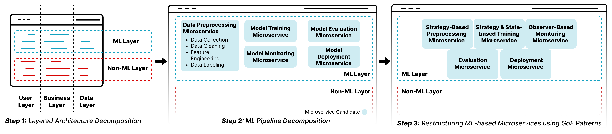
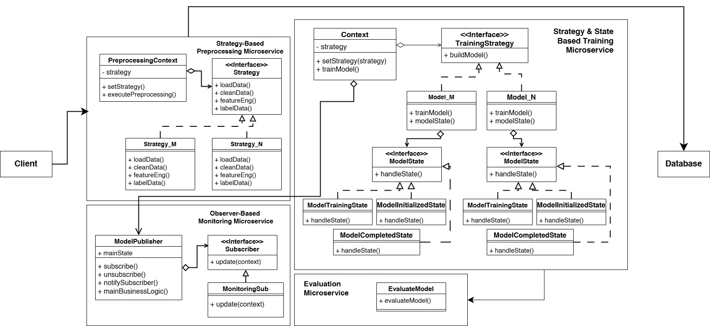

# CIFAR10MSPREDICT

## Paper Objective

In this work, our primary objective is to propose a pattern-based microservices identification methodology to guide the migration of monolithic ML-based systems to microservices, which is structured into three distinct steps:

1. **Layered ML Architecture Pattern**: This pattern separates architectural layers within the monolithic ML-based system, isolating the ML layer from other layers and promoting modularity. This separation enables a more precise identification of business functionalities, establishing a strong foundation for decomposing monolithic ML-based systems.

2. **ML Pipeline Pattern**: We use this pattern to identify microservices candidates within the ML layer based on the different ML pipeline stages. This step ensures reduced interservice coupling by clearly identifying each microservice's role in the pipeline. This allows for independent scaling, maintenance, and optimization.

3. **GoF Design Patterns**: In the final step, we apply well-established design patterns like Strategy, State, and Observer to restructure and optimize the identified microservices. These patterns are adapted to the ML context and have demonstrated robustness in system restructuring.

## Methodology Overview

## Case Study Description

For evaluating the migration of ML-based monolithic systems to microservices, we used a monolithic ML-based image classification system built with Python and Flask, using the CIFAR-10 dataset [CIFAR-10 dataset](https://www.cs.toronto.edu/~kriz/cifar.html). The system includes a front-end interface where users can upload images to receive predictions based on an image recognition model. 

The system employs two types of ML models for image classification:
1. Convolutional Neural Network (CNN) models
2. DenseNet models

We chose this monolithic ML-based system for our evaluation because it encompasses various stages of the ML pipeline, represents a common use case in ML ecosystems, and is built on an open-source dataset, allowing for reproducibility and validation by other researchers.

## Monolith System Architecture

The system includes various stages of the ML pipeline:
- **Preprocessing Phase**: Includes data cleaning, feature engineering, data labeling, and data collection.
- **Model Training Phase**: Responsible for model initialization, hyperparameter tuning, and optimization.
- **Model Evaluation Phase**: Assesses model performance through metrics and error analysis.
- **Model Deployment Phase**: Not included in the case study but involves serving models in production.
- **Monitoring Phase**: Ensures ongoing performance checks and logging.

## Final Microservices-Based ML System Architecture

The final architecture uses microservices to manage key stages of the ML pipeline. These microservices align with the principles of modularity, scalability, and flexibility. The identified microservices are:

1. **Preprocessing Microservice**: Handles tasks like data cleaning, transformation, and feature engineering.
2. **Model Training Microservice**: Responsible for training ML models using the preprocessed data.
3. **Model Evaluation Microservice**: Evaluates model performance using various metrics and validation techniques.
4. **Model Monitoring Microservice**: Monitors the performance of deployed models, ensuring their ongoing effectiveness.

After identifying the candidate microservices, we applied GoF design patterns to structure them effectively:
- **Strategy Pattern**: Used in the preprocessing microservice to select between different preprocessing strategies, such as basic preprocessing and data augmentation.
- **State Pattern**: Applied in the model training microservice to manage different phases of the training lifecycle.
- **Observer Pattern**: Used in the model monitoring microservice to enable real-time tracking of performance metrics.

## Conclusion

This methodology showcases a novel approach for migrating ML-based monolithic systems to microservices using structured design patterns. It enhances:
- **Scalability**: Microservices can be independently scaled based on needs.
- **Maintainability**: Modular design reduces coupling between components.
- **Flexibility**: The system can easily adapt to various ML applications."# AIAppCodeTemplate" 
